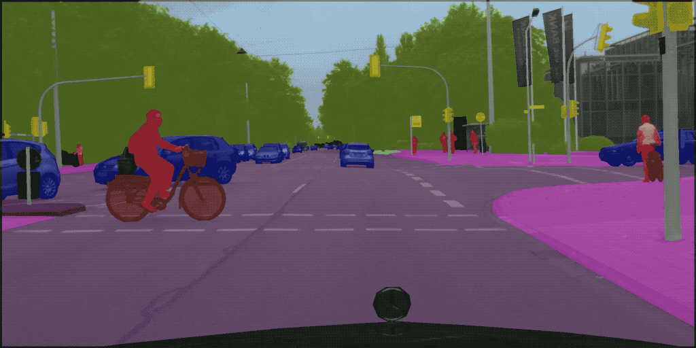

# MMSegmentation

## Introduction

The master branch works with **PyTorch 1.3 to 1.5**.

MMSegmentation is an open source object semantic segmentation toolbox based on PyTorch.
It is a part of the OpenMMLab project developed by [Multimedia Laboratory, CUHK](http://mmlab.ie.cuhk.edu.hk/).



### Major features

- **Modular Design**

  We decompose the detection framework into different components and one can easily construct a customized object detection framework by combining different modules.

- **Support of multiple frameworks out of box**

  The toolbox directly supports popular and contemporary semantic segmentation frameworks, *e.g.* PSPNet, DeepLabV3, PSANet, DeepLabV3+, etc.

- **High efficiency**

  All basic bbox and mask operations run on GPUs. The training speed is faster than or comparable to other codebases, including [xxx]().

Apart from MMSegmentation, we also released a library [mmcv](https://github.com/open-mmlab/mmcv) for computer vision research, which is heavily depended on by this toolbox.

## License

This project is released under the [Apache 2.0 license](LICENSE).

## Installation

Please refer to [INSTALL.md](docs/install.md) for installation and dataset preparation.

## Get Started

Please see [getting_started.md](docs/getting_started.md) for the basic usage of MMSegmentation. There are also tutorials for [finetuning models](docs/tutorials/finetune.md), [adding new dataset](docs/tutorials/new_dataset.md), [designing data pipeline](docs/tutorials/data_pipeline.md), and [adding new modules](docs/tutorials/new_modules.md).

## Contributing

We appreciate all contributions to improve MMSegmentation. Please refer to [CONTRIBUTING.md](.github/CONTRIBUTING.md) for the contributing guideline.

## Acknowledgement

MMSegmentation is an open source project that is contributed by researchers and engineers from various colleges and companies. We appreciate all the contributors who implement their methods or add new features, as well as users who give valuable feedbacks.
We wish that the toolbox and benchmark could serve the growing research community by providing a flexible toolkit to reimplement existing methods and develop their own new detectors.


## Citation

If you use this toolbox or benchmark in your research, please cite this project.

```
@misc{mmseg2019,
  author={Xu, Jiarui and Chen Kai},
  title={semseg},
  howpublished={\url{https://github.com/open-mmlab/mmsegmentation}},
  year={2020}
}
```


## Contact

This repo is currently maintained by Kai Chen ([@hellock](http://github.com/hellock)), Jiarui Xu ([@xvjiarui](https://github.com/xvjiarui)).
