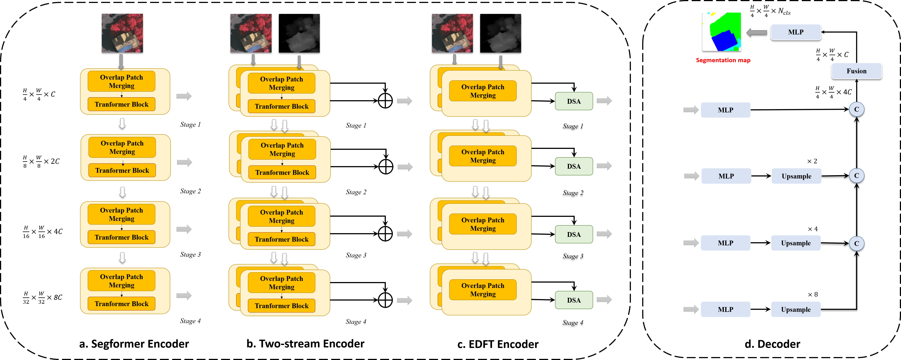

# Efficient Depth Fusion Transformer for Aerial Image Semantic Segmentation

<div align="center">
  
</div>

Paper can be download [here](https://www.mdpi.com/2072-4292/14/5/1294).

## Installation

Please refer to [get_started.md](docs/get_started.md) for installation

## Testing

Trained weights will be put on later.

## Training

```
# Single-gpu training
python tools\train.py configs\segformer\segformer_mit_fuse-b0_256x256_20k_vai.py
```

## Citation

```
@Article{rs14051294,
	AUTHOR = {Yan, Li and Huang, Jianming and Xie, Hong and Wei, Pengcheng and Gao, Zhao},
	TITLE = {Efficient Depth Fusion Transformer for Aerial Image Semantic Segmentation},
	JOURNAL = {Remote Sensing},
	VOLUME = {14},
	YEAR = {2022},
	NUMBER = {5},
	ARTICLE-NUMBER = {1294},
	URL = {https://www.mdpi.com/2072-4292/14/5/1294},
	ISSN = {2072-4292},
	DOI = {10.3390/rs14051294}
}
```
