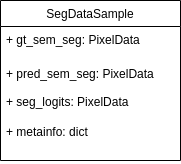

# Dataflow

In this chapter, we will introduce the dataflow and data format convention between the internal modules managed by the [Runner](https://mmengine.readthedocs.io/en/latest/tutorials/runner.html).

## Overview of dataflow

As illustrated in the [Runner document of MMEngine](https://mmengine.readthedocs.io/en/latest/tutorials/runner.html), the following diagram shows the basic dataflow.


The dashed border, gray filled shapes represent different data formats, while solid boxes represent modules/methods. Due to the great flexibility and extensibility of MMEngine, some critical base classes can be inherited and their methods can be overridden. The diagram above only holds when users are not customizing `TrainLoop`, `ValLoop`, and `TestLoop` in `Runner`, and are not overriding `train_step`, `val_step` and `test_step` method in their custom model.

## Dataflow convention in MMSegmentation

From the diagram above, we could see the basic dataflow. In this section, we would introduce format convention of data involved in this dataflow, respectively.

### DataLoader to Data Preprocessor

DataLoader is an essential component in training and testing pipelines of MMEngine. Conceptually, it is derived from and consistent with [PyTorch](https://pytorch.org/). DataLoader loads data from filesystem and the original data passes through data preparation pipeline, then it would be sent to Data Preprocessor.

MMSegmentation defines the default data format at [PackSegInputs](https://github.com/open-mmlab/mmsegmentation/blob/dev-1.x/mmseg/datasets/transforms/formatting.py#L12), it's the last component of `train_pipeline` and `test_pipeline`. Please refer to [data transform documentation](https://mmsegmentation.readthedocs.io/en/dev-1.x/advanced_guides/transforms.html) for more information about data transform `pipeline`.

Without any modifications, the return value of PackSegInputs is usually a `dict` and has only two keys, `inputs` and `data_samples`. The following pseudo-code shows the data types of the values corresponding to the data loader output, `inputs` is the input tenor to the model and `data_samples` contains a list of input images' meta information.

```python
dict(
    inputs=torch.Tensor,
    data_samples=List[SegDataSample]
)
```

**Note:** [SegDataSample](https://github.com/open-mmlab/mmsegmentation/blob/1.x/mmseg/structures/seg_data_sample.py) is a data structure interface of MMSegmentation, it is used as an interface between different components. `SegDataSample` implements the abstract data element `mmengine.structures.BaseDataElement`, please refer to [the SegDataSample documentation](https://mmsegmentation.readthedocs.io/en/1.x/advanced_guides/structures.html) and [data element documentation](https://mmengine.readthedocs.io/en/latest/advanced_tutorials/data_element.html) in [MMEngine](https://github.com/open-mmlab/mmengine) for more information.

### Data Preprocessor to Model

Though drawn separately in the diagram [above](#overview-of-dataflow), data_preprocessor is a part of the model and thus can be found in [Model tutorial](https://mmsegmentation.readthedocs.io/en/dev-1.x/advanced_guides/models.html) at Seg DataPreprocessor chapter.

The return value of Data Preprocessor is a dict, contains `inputs` and `data_samples`, `inputs` would be transferred to GPU and some additional metainfo like `pad_shape` and `padding_size` would be added to the `data_samples`. When transfer to the network, the dict would be unpacked to two values. The following pseudo-codes show the return value of data preprocessor and the input values of model.

```python
dict(
    inputs=torch.Tensor,
    data_samples=Optional[List[SegDataSample], None]
)
```

```python
class Network(BaseSegmentor):

    def forward(self, inputs: torch.Tensor, data_samples: List[SegDataSample], mode: str):
        pass
```

### Model output

#### To Evaluator

At the evaluation procedure, the inference results would be transferred to `Evaluator`. You might read the [evaluation document](https://mmsegmentation.readthedocs.io/en/dev-1.x/advanced_guides/evaluation.html) for more information about `Evaluator`.

After inference, the [BaseSegmentor](https://github.com/open-mmlab/mmsegmentation/blob/dev-1.x/mmseg/models/segmentors/base.py#L15) in MMSegmentation would do a simple post process to pack inference results, the segmentation logits produced by the neural network, segmentation mask after the `argmax` operation and ground truth(if exists) would be packed into a similar `SegDataSample` instance. The return value of [postprocess_result](https://github.com/open-mmlab/mmsegmentation/blob/dev-1.x/mmseg/models/segmentors/base.py#L132) is a **`List` of `SegDataSample`**. Following diagram shows the key properties of these `SegDataSample` instances.



#### Optim Wrapper

The same as Data Preprocessor, loss function is also a part of the model, it's a property of [decode head](https://github.com/open-mmlab/mmsegmentation/blob/dev-1.x/mmseg/models/decode_heads/decode_head.py#L142).

In MMSegmentation, the method [loss_by_feat](https://github.com/open-mmlab/mmsegmentation/blob/dev-1.x/mmseg/models/decode_heads/decode_head.py#L291) of `decode_head` is an unified interface used to compute loss.

Parameters:

- seg_logits (Tensor): The output from decode head forward function.
- batch_data_samples (List\[:obj:`SegDataSample`\]): The seg data samples. It usually includes information such as `metainfo` and `gt_sem_seg`.

Returns:

- dict\[str, Tensor\]: a dictionary of loss components
