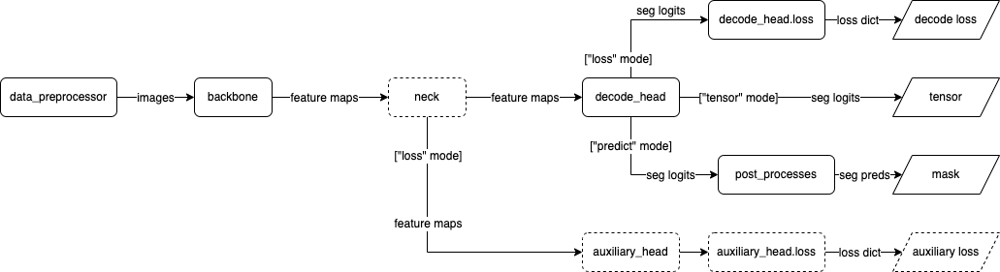
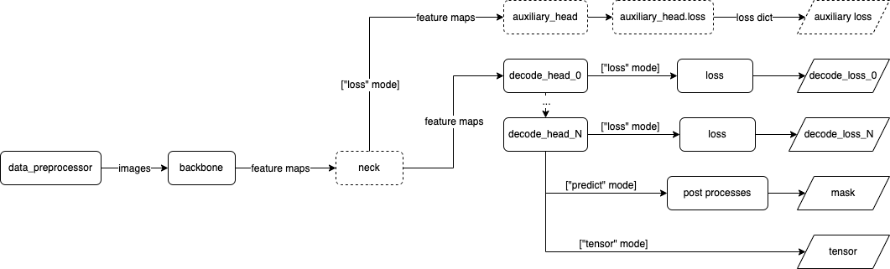
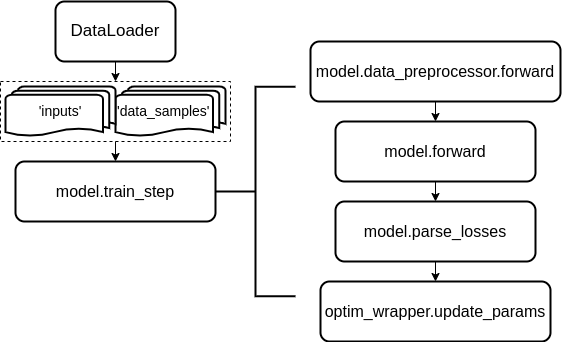
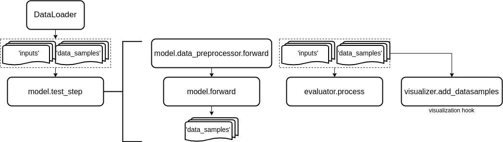

# Models

# Models

We usually define a neural network in a deep learning task as a model, and this model is the core of an algorithm. [MMEngine](https://github.com/open-mmlab/mmengine) abstracts a unified model [BaseModel](https://github.com/open-mmlab/mmengine/blob/main/mmengine/model/base_model/base_model.py#L16) to standardize the interfaces for training, testing and other processes. All models implemented by MMSegmentation inherit from `BaseModel`, and in MMSegmentation we implemented forward and added some functions for the semantic segmentation algorithm.

## Common components

### Segmentor

In MMSegmentation, we abstract the network architecture as a **Segmentor**, it is a model that contains all components of a network. We have already implemented **EncoderDecoder** and **CascadeEncoderDecoder**, which typically consist of **Data preprocessor**, **Backbone**, **Decode head** and **Auxiliary head**.

### Data preprocessor

**Data preprocessor** is the part that copies data to the target device and preprocesses the data into the model input format.

### Backbone

**Backbone** is the part that transforms an image to feature maps, such as a **ResNet-50** without the last fully connected layer.

### Neck

**Neck** is the part that connects the backbone and heads. It performs some refinements or reconfigurations on the raw feature maps produced by the backbone. An example is **Feature Pyramid Network (FPN)**.

### Decode Head

**Decode Head** is the part that transforms the feature maps into a segmentation mask, such as **PSPNet**.

### Auxiliary head

**Auxiliary head** is an optional component that transforms the feature maps into segmentation masks which only used for computing auxiliary losses.

## Basic interfaces

MMSegmentation wraps `BaseModel` and implements the [BaseSegmentor](https://github.com/open-mmlab/mmsegmentation/blob/1.x/mmseg/models/segmentors/base.py#L15) class, which mainly provides the interfaces `forward`, `train_step`, `val_step` and `test_step`. The following will introduce these interfaces in detail.

### forward

<center>
  
  <center>EncoderDecoder dataflow</center>
</center>

<center>
  <center></center>
  <center>CascadeEncoderDecoder dataflow</center>
</center>

The `forward` method returns losses or predictions of training, validation, testing, and a simple inference process.

The method should accept three modes: "tensor", "predict" and "loss":

- "tensor": Forward the whole network and return the tensor or tuple of tensor without any post-processing, same as a common `nn.Module`.
- "predict": Forward and return the predictions, which are fully processed to a list of `SegDataSample`.
- "loss": Forward and return a `dict` of losses according to the given inputs and data samples.

**Note:** [SegDataSample](https://github.com/open-mmlab/mmsegmentation/blob/1.x/mmseg/structures/seg_data_sample.py) is a data structure interface of MMSegmentation, it is used as an interface between different components. `SegDataSample` implements the abstract data element `mmengine.structures.BaseDataElement`, please refer to [the SegDataSample documentation](https://mmsegmentation.readthedocs.io/en/1.x/advanced_guides/structures.html) and [data element documentation](https://mmengine.readthedocs.io/en/latest/advanced_tutorials/data_element.html) in [MMEngine](https://github.com/open-mmlab/mmengine) for more information.

Note that this method doesn't handle either backpropagation or optimizer updating, which are done in the method `train_step`.

Parameters:

- inputs (torch.Tensor) - The input tensor with shape (N, C, ...) in general.
- data_sample (list\[[SegDataSample](https://github.com/open-mmlab/mmsegmentation/blob/1.x/mmseg/structures/seg_data_sample.py)\]) - The seg data samples. It usually includes information such as `metainfo` and `gt_sem_seg`. Default to None.
- mode (str) - Return what kind of value. Defaults to 'tensor'.

Returns:

- `dict` or `list`:
  - If `mode == "loss"`, return a `dict` of loss tensor used for backward and logging.
  - If `mode == "predict"`, return a `list` of `SegDataSample`, the inference results will be incrementally added to the `data_sample` parameter passed to the forward method, each `SegDataSample` contains the following keys:
    - pred_sem_seg (`PixelData`): Prediction of semantic segmentation.
    - seg_logits (`PixelData`): Predicted logits of semantic segmentation before normalization.
  - If `mode == "tensor"`, return a `tensor` or `tuple of tensor` or `dict` of `tensor` for custom use.

### prediction modes

We briefly describe the fields of the model's configuration in [the config documentation](../user_guides/1_config.md), here we elaborate on the `model.test_cfg` field. `model.test_cfg` is used to control forward behavior, the `forward` method in `"predict"` mode can run in two modes:

- `whole_inference`: If `cfg.model.test_cfg.mode == 'whole'`, model will inference with full images.

  An `whole_inference` mode example config:

  ```python
  model = dict(
    type='EncoderDecoder'
    ...
    test_cfg=dict(mode='whole')
  )
  ```

- `slide_inference`: If `cfg.model.test_cfg.mode == 'slide'`, model will inference by sliding-window. **Note:** if you select the `slide` mode, `cfg.model.test_cfg.stride` and `cfg.model.test_cfg.crop_size` should also be specified.

  An `slide_inference` mode example config:

  ```python
  model = dict(
    type='EncoderDecoder'
    ...
    test_cfg=dict(mode='slide', crop_size=256, stride=170)
  )
  ```

### train_step

The `train_step` method calls the forward interface of the `loss` mode to get the loss `dict`. The `BaseModel` class implements the default model training process including preprocessing, model forward propagation, loss calculation, optimization, and back-propagation.

Parameters:

- data (dict or tuple or list) - Data sampled from the dataset. In MMSegmentation, the data dict contains `inputs` and `data_samples` two fields.
- optim_wrapper (OptimWrapper) - OptimWrapper instance used to update model parameters.

**Note:** [OptimWrapper](https://github.com/open-mmlab/mmengine/blob/main/mmengine/optim/optimizer/optimizer_wrapper.py#L17) provides a common interface for updating parameters, please refer to optimizer wrapper [documentation](https://mmengine.readthedocs.io/zh_CN/latest/tutorials/optim_wrapper.html) in [MMEngine](https://github.com/open-mmlab/mmengine) for more information.

Returns:

- Dict\[str, `torch.Tensor`\]: A `dict` of tensor for logging.

<center>
  
  <center>train_step dataflow</center>
</center>

### val_step

The `val_step` method calls the forward interface of the `predict` mode and returns the prediction result, which is further passed to the process interface of the evaluator and the `after_val_iter` interface of the Hook.

Parameters:

- data (`dict` or `tuple` or `list`) - Data sampled from the dataset. In MMSegmentation, the data dict contains `inputs` and `data_samples` two fields.

Returns:

- `list` - The predictions of given data.

<center>
  
  <center>test_step/val_step dataflow</center>
</center>

### test_step

The `BaseModel` implements `test_step` the same as `val_step`.

## Data Preprocessor

The [SegDataPreProcessor](https://github.com/open-mmlab/mmsegmentation/blob/1.x/mmseg/models/data_preprocessor.py#L13) implemented by MMSegmentation inherits from the [BaseDataPreprocessor](https://github.com/open-mmlab/mmengine/blob/main/mmengine/model/base_model/data_preprocessor.py#L18) implemented by [MMEngine](https://github.com/open-mmlab/mmengine) and provides the functions of data preprocessing and copying data to the target device.

The runner carries the model to the specified device during the construction stage, while the data is carried to the specified device by the [SegDataPreProcessor](https://github.com/open-mmlab/mmsegmentation/blob/1.x/mmseg/models/data_preprocessor.py#L13) in `train_step`, `val_step`, and `test_step`, and the processed data is further passed to the model.

The parameters of the `SegDataPreProcessor` constructor:

- mean (Sequence\[Number\], optional) - The pixel mean of R, G, B channels. Defaults to None.
- std (Sequence\[Number\], optional) - The pixel standard deviation of R, G, B channels. Defaults to None.
- size (tuple, optional) - Fixed padding size.
- size_divisor (int, optional) - The divisor of padded size.
- pad_val (float, optional) - Padding value. Default: 0.
- seg_pad_val (float, optional) - Padding value of segmentation map. Default: 255.
- bgr_to_rgb (bool) - whether to convert image from BGR to RGB. Defaults to False.
- rgb_to_bgr (bool) - whether to convert image from RGB to RGB. Defaults to False.
- batch_augments (list\[dict\], optional) - Batch-level augmentations. Default to None.

The data will be processed as follows:

- Collate and move data to the target device.
- Pad inputs to the input size with defined `pad_val`, and pad seg map with defined `seg_pad_val`.
- Stack inputs to batch_inputs.
- Convert inputs from bgr to rgb if the shape of input is (3, H, W).
- Normalize image with defined std and mean.
- Do batch augmentations like Mixup and Cutmix during training.

The parameters of the `forward` method:

- data (dict) - data sampled from dataloader.
- training (bool) - Whether to enable training time augmentation.

The returns of the `forward` method:

- Dict: Data in the same format as the model input.
