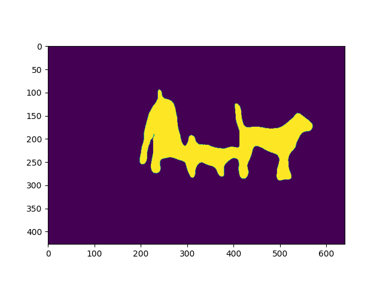

Apart from training/testing scripts, We provide lots of useful tools under the
 `tools/` directory.

### Get the FLOPs and params (experimental)

We provide a script adapted from [flops-counter.pytorch](https://github.com/sovrasov/flops-counter.pytorch) to compute the FLOPs and params of a given model.

```shell
python tools/get_flops.py ${CONFIG_FILE} [--shape ${INPUT_SHAPE}]
```

You will get the result like this.

```none
==============================
Input shape: (3, 2048, 1024)
Flops: 1429.68 GMac
Params: 48.98 M
==============================
```

**Note**: This tool is still experimental and we do not guarantee that the number is correct. You may well use the result for simple comparisons, but double check it before you adopt it in technical reports or papers.

(1) FLOPs are related to the input shape while parameters are not. The default input shape is (1, 3, 1280, 800).
(2) Some operators are not counted into FLOPs like GN and custom operators.

### Publish a model

Before you upload a model to AWS, you may want to
(1) convert model weights to CPU tensors, (2) delete the optimizer states and
(3) compute the hash of the checkpoint file and append the hash id to the filename.

```shell
python tools/publish_model.py ${INPUT_FILENAME} ${OUTPUT_FILENAME}
```

E.g.,

```shell
python tools/publish_model.py work_dirs/pspnet/latest.pth psp_r50_hszhao_200ep.pth
```

The final output filename will be `psp_r50_512x1024_40ki_cityscapes-{hash id}.pth`.

### Convert to ONNX (experimental)

We provide a script to convert model to [ONNX](https://github.com/onnx/onnx) format. The converted model could be visualized by tools like [Netron](https://github.com/lutzroeder/netron). Besides, we also support comparing the output results between PyTorch and ONNX model.

```bash
python tools/pytorch2onnx.py \
    ${CONFIG_FILE} \
    --checkpoint ${CHECKPOINT_FILE} \
    --output-file ${ONNX_FILE} \
    --input-img ${INPUT_IMG} \
    --shape ${INPUT_SHAPE} \
    --rescale-shape ${RESCALE_SHAPE} \
    --show \
    --verify \
    --dynamic-export \
    --cfg-options \
      model.test_cfg.mode="whole"
```

Description of arguments:

- `config` : The path of a model config file.
- `--checkpoint` : The path of a model checkpoint file.
- `--output-file`: The path of output ONNX model. If not specified, it will be set to `tmp.onnx`.
- `--input-img` : The path of an input image for conversion and visualize.
- `--shape`: The height and width of input tensor to the model. If not specified, it will be set to img_scale of test_pipeline.
- `--rescale-shape`: rescale shape of output, set this value to avoid OOM, only work on `slide` mode.
- `--show`: Determines whether to print the architecture of the exported model. If not specified, it will be set to `False`.
- `--verify`: Determines whether to verify the correctness of an exported model. If not specified, it will be set to `False`.
- `--dynamic-export`: Determines whether to export ONNX model with dynamic input and output shapes. If not specified, it will be set to `False`.
- `--cfg-options`:Update config options.

**Note**: This tool is still experimental. Some customized operators are not supported for now.

### Evaluate ONNX model

We provide `tools/deploy_test.py` to evaluate ONNX model with different backend.

#### Prerequisite

- Install onnx and onnxruntime-gpu

  ```shell
  pip install onnx onnxruntime-gpu
  ```

- Install TensorRT following [how-to-build-tensorrt-plugins-in-mmcv](https://mmcv.readthedocs.io/en/latest/tensorrt_plugin.html#how-to-build-tensorrt-plugins-in-mmcv)(optional)

#### Usage

```bash
python tools/deploy_test.py \
    ${CONFIG_FILE} \
    ${MODEL_FILE} \
    ${BACKEND} \
    --out ${OUTPUT_FILE} \
    --eval ${EVALUATION_METRICS} \
    --show \
    --show-dir ${SHOW_DIRECTORY} \
    --options ${CFG_OPTIONS} \
    --eval-options ${EVALUATION_OPTIONS} \
    --opacity ${OPACITY} \
```

Description of all arguments

- `config`: The path of a model config file.
- `model`: The path of a converted model file.
- `backend`: Backend of the inference, options: `onnxruntime`, `tensorrt`.
- `--out`: The path of output result file in pickle format.
- `--format-only` : Format the output results without perform evaluation. It is useful when you want to format the result to a specific format and submit it to the test server. If not specified, it will be set to `False`. Note that this argument is **mutually exclusive** with `--eval`.
- `--eval`: Evaluation metrics, which depends on the dataset, e.g., "mIoU" for generic datasets, and "cityscapes" for Cityscapes. Note that this argument is **mutually exclusive** with `--format-only`.
- `--show`: Show results flag.
- `--show-dir`: Directory where painted images will be saved
- `--options`: Override some settings in the used config file, the key-value pair in `xxx=yyy` format will be merged into config file.
- `--eval-options`: Custom options for evaluation, the key-value pair in `xxx=yyy` format will be kwargs for `dataset.evaluate()` function
- `--opacity`: Opacity of painted segmentation map. In (0, 1] range.

#### Results and Models

|   Model    |                     Config                      |  Dataset   | Metric | PyTorch | ONNXRuntime | TensorRT-fp32 | TensorRT-fp16 |
| :--------: | :---------------------------------------------: | :--------: | :----: | :-----: | :---------: | :-----------: | :-----------: |
|    FCN     |      fcn_r50-d8_512x1024_40k_cityscapes.py      | cityscapes |  mIoU  |  72.2   |    72.2     |     72.2      |     72.2      |
|   PSPNet   |    pspnet_r50-d8_512x1024_40k_cityscapes.py     | cityscapes |  mIoU  |  77.8   |    77.8     |     77.8      |     77.8      |
| deeplabv3  |   deeplabv3_r50-d8_512x1024_40k_cityscapes.py   | cityscapes |  mIoU  |  79.0   |    79.0     |     79.0      |     79.0      |
| deeplabv3+ | deeplabv3plus_r50-d8_512x1024_40k_cityscapes.py | cityscapes |  mIoU  |  79.6   |    79.5     |     79.5      |     79.5      |
|   PSPNet   |     pspnet_r50-d8_769x769_40k_cityscapes.py     | cityscapes |  mIoU  |  78.2   |    78.1     |               |               |
| deeplabv3  |   deeplabv3_r50-d8_769x769_40k_cityscapes.py    | cityscapes |  mIoU  |  78.5   |    78.3     |               |               |
| deeplabv3+ | deeplabv3plus_r50-d8_769x769_40k_cityscapes.py  | cityscapes |  mIoU  |  78.9   |    78.7     |               |               |

**Note**: TensorRT is only available on configs with `whole mode`.

### Convert to TorchScript (experimental)

We also provide a script to convert model to [TorchScript](https://pytorch.org/docs/stable/jit.html) format. You can use the pytorch C++ API [LibTorch](https://pytorch.org/docs/stable/cpp_index.html) inference the trained model. The converted model could be visualized by tools like [Netron](https://github.com/lutzroeder/netron). Besides, we also support comparing the output results between PyTorch and TorchScript model.

```shell
python tools/pytorch2torchscript.py \
    ${CONFIG_FILE} \
    --checkpoint ${CHECKPOINT_FILE} \
    --output-file ${ONNX_FILE}
    --shape ${INPUT_SHAPE}
    --verify \
    --show
```

Description of arguments:

- `config` : The path of a pytorch model config file.
- `--checkpoint` : The path of a pytorch model checkpoint file.
- `--output-file`: The path of output TorchScript model. If not specified, it will be set to `tmp.pt`.
- `--input-img` : The path of an input image for conversion and visualize.
- `--shape`: The height and width of input tensor to the model. If not specified, it will be set to `512 512`.
- `--show`: Determines whether to print the traced graph of the exported model. If not specified, it will be set to `False`.
- `--verify`: Determines whether to verify the correctness of an exported model. If not specified, it will be set to `False`.

**Note**: It's only support PyTorch>=1.8.0 for now.

**Note**: This tool is still experimental. Some customized operators are not supported for now.

Examples:

- Convert the cityscapes PSPNet pytorch model.

  ```shell
  python tools/pytorch2torchscript.py configs/pspnet/pspnet_r50-d8_512x1024_40k_cityscapes.py \
  --checkpoint checkpoints/pspnet_r50-d8_512x1024_40k_cityscapes_20200605_003338-2966598c.pth \
  --output-file checkpoints/pspnet_r50-d8_512x1024_40k_cityscapes_20200605_003338-2966598c.pt \
  --shape 512 1024
  ```

### Convert to TensorRT (experimental)

A script to convert [ONNX](https://github.com/onnx/onnx) model to [TensorRT](https://developer.nvidia.com/tensorrt) format.

Prerequisite

- install `mmcv-full` with ONNXRuntime custom ops and TensorRT plugins follow [ONNXRuntime in mmcv](https://mmcv.readthedocs.io/en/latest/onnxruntime_op.html) and [TensorRT plugin in mmcv](https://github.com/open-mmlab/mmcv/blob/master/docs/tensorrt_plugin.md).
- Use [pytorch2onnx](#convert-to-onnx-experimental) to convert the model from PyTorch to ONNX.

Usage

```bash
python ${MMSEG_PATH}/tools/onnx2tensorrt.py \
    ${CFG_PATH} \
    ${ONNX_PATH} \
    --trt-file ${OUTPUT_TRT_PATH} \
    --min-shape ${MIN_SHAPE} \
    --max-shape ${MAX_SHAPE} \
    --input-img ${INPUT_IMG} \
    --show \
    --verify
```

Description of all arguments

- `config` : Config file of the model.
- `model` : Path to the input ONNX model.
- `--trt-file` : Path to the output TensorRT engine.
- `--max-shape` : Maximum shape of model input.
- `--min-shape` : Minimum shape of model input.
- `--fp16` : Enable fp16 model conversion.
- `--workspace-size` : Max workspace size in GiB.
- `--input-img` : Image for visualize.
- `--show` : Enable result visualize.
- `--dataset` : Palette provider, `CityscapesDataset` as default.
- `--verify` : Verify the outputs of ONNXRuntime and TensorRT.
- `--verbose` : Whether to verbose logging messages while creating TensorRT engine. Defaults to False.

**Note**: Only tested on whole mode.

## Miscellaneous

### Print the entire config

`tools/print_config.py` prints the whole config verbatim, expanding all its
 imports.

```shell
python tools/print_config.py \
  ${CONFIG} \
  --graph \
  --options ${OPTIONS [OPTIONS...]} \
```

Description of arguments:

- `config` : The path of a pytorch model config file.
- `--graph` : Determines whether to print the models graph.
- `--options`: Custom options to replace the config file.

### Plot training logs

`tools/analyze_logs.py` plots loss/mIoU curves given a training log file. `pip install seaborn` first to install the dependency.

```shell
python tools/analyze_logs.py xxx.log.json [--keys ${KEYS}] [--legend ${LEGEND}] [--backend ${BACKEND}] [--style ${STYLE}] [--out ${OUT_FILE}]
```

Examples:

- Plot the mIoU, mAcc, aAcc metrics.

  ```shell
  python tools/analyze_logs.py log.json --keys mIoU mAcc aAcc --legend mIoU mAcc aAcc
  ```

- Plot loss metric.

  ```shell
  python tools/analyze_logs.py log.json --keys loss --legend loss
  ```

## Model Serving

In order to serve an `MMSegmentation` model with [`TorchServe`](https://pytorch.org/serve/), you can follow the steps:

### 1. Convert model from MMSegmentation to TorchServe

```shell
python tools/mmseg2torchserve.py ${CONFIG_FILE} ${CHECKPOINT_FILE} \
--output-folder ${MODEL_STORE} \
--model-name ${MODEL_NAME}
```

**Note**: ${MODEL_STORE} needs to be an absolute path to a folder.

### 2. Build `mmseg-serve` docker image

```shell
docker build -t mmseg-serve:latest docker/serve/
```

### 3. Run `mmseg-serve`

Check the official docs for [running TorchServe with docker](https://github.com/pytorch/serve/blob/master/docker/README.md#running-torchserve-in-a-production-docker-environment).

In order to run in GPU, you need to install [nvidia-docker](https://docs.nvidia.com/datacenter/cloud-native/container-toolkit/install-guide.html). You can omit the `--gpus` argument in order to run in CPU.

Example:

```shell
docker run --rm \
--cpus 8 \
--gpus device=0 \
-p8080:8080 -p8081:8081 -p8082:8082 \
--mount type=bind,source=$MODEL_STORE,target=/home/model-server/model-store \
mmseg-serve:latest
```

[Read the docs](https://github.com/pytorch/serve/blob/072f5d088cce9bb64b2a18af065886c9b01b317b/docs/rest_api.md) about the Inference (8080), Management (8081) and Metrics (8082) APis

### 4. Test deployment

```shell
curl -O https://raw.githubusercontent.com/open-mmlab/mmsegmentation/master/resources/3dogs.jpg
curl http://127.0.0.1:8080/predictions/${MODEL_NAME} -T 3dogs.jpg -o 3dogs_mask.png
```

The response will be a ".png" mask.

You can visualize the output as follows:

```python
import matplotlib.pyplot as plt
import mmcv
plt.imshow(mmcv.imread("3dogs_mask.png", "grayscale"))
plt.show()
```

You should see something similar to:


